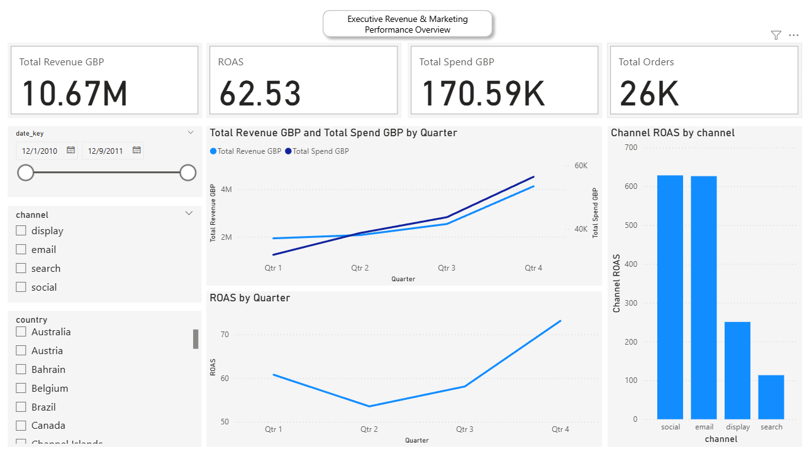

# 📊 **E-Commerce Revenue, Marketing & Business Intelligence Pipeline**
### *End-to-End SQL ETL, Data Warehousing & Power BI Analytics Project*



This project implements a complete, production-style Business Intelligence ecosystem. It demonstrates the full lifecycle of a modern analytics workflow:

**Raw Data → ETL → Staging → Dimensional Modeling → Fact Tables → Aggregations → Data Quality Checks → Power BI Dashboards**

The system ingests e-commerce transaction data and synthetic ad-spend data, builds a robust warehouse using PostgreSQL, and surfaces insights through Power BI dashboards. Everything is containerized with Docker for ease of deployment and reproducibility.

---

## 🚀 **Project Highlights**

### ✔ Fully Automated ETL Pipeline
- Python-based ingestion of raw CSV files  
- SQL-based transformations for cleaning and standardization  
- Dimension & Fact modeling following the Kimball approach  
- Daily aggregated metrics for efficient BI reporting  
- Marketing ad spend integration for ROAS analysis  
- Cohort modeling and retention calculations  
- Automated data quality checks  

### ✔ Modern Data Architecture
- **Raw → Staging → Warehouse → Data Marts**  
- Clear separation of concerns  
- Star schema optimized for Power BI  
- Incremental-load ready (partition-friendly design)  

### ✔ Strong Business Impact
This project answers real company questions:

- Which marketing channels produce the best ROAS?  
- How does daily ad spend correlate with revenue?  
- Which products drive the most sales?  
- How do countries differ in purchase behavior?  
- How do customer cohorts perform after acquisition?  
- Are there data quality issues affecting decisions?  

---

## 🛠 **Tech Stack**

**Languages:**  
- Python  
- SQL (PostgreSQL)

**Tools & Frameworks:**  
- Docker  
- PostgreSQL 17  
- Power BI Desktop  
- Pandas, psycopg2  
- DAX  

**Modeling:**  
- Star schema  
- Fact/Dimension modeling  
- Cohorts & retention analysis  

---

## 📂 **Repository Structure**

```
.
├── data/
│   ├── raw_sales_data.csv
│   └── ad_spend.csv
│
├── pipeline/
│   └── load_raw.py
│
├── sql/
│   ├── staging_cleaning.sql
│   ├── dims_facts.sql
│   ├── aggregates_daily.sql
│   ├── cohorts.sql
│   └── quality_checks.sql
│
├── project/
│   └── Dockerfile
│
├── demo/
│   ├── Performance Dashboard.pbix
│   └── screenshots/
│
├── .dockerignore
├── .gitignore
├── .docker-compose.yml
├── LICENSE
├── README.md
└── requirements.txt

```

---

## 🏗 **Pipeline Architecture Overview**

### 1️⃣ **Raw Layer**
Python loads raw CSVs into Postgres:

- `raw_sales_data` – transaction-level e-commerce data  
- `ad_spend` – daily spend by marketing channel  

This mirrors source systems with no transformations.

---

### 2️⃣ **Staging Layer**  
`staging_cleaning.sql` performs:

#### **Sales Cleaning**
- Encode/UTF-8 cleanup  
- Date normalization  
- Removal of cancelled invoices  
- Quantity/price validation  
- Deduplication  
- Country normalization  

#### **Ad Spend Cleaning**
- Channel normalization  
- Removal of out-of-range dates  
- Deduplication  
- Currency & numeric enforcement  

Outputs clean, standardized stage tables.

---

### 3️⃣ **Warehouse Modeling (Dimensions & Facts)**  
`dims_facts.sql` builds the star schema:

#### **Dimensions**
- `dim_date`  
- `dim_customer`  
- `dim_product`  

#### **Facts**
- `fct_orders`  
- `fct_order_items`  

Surrogate keys generated via sequences.

---

### 4️⃣ **Daily Metrics (Data Mart)**  
`aggregates_daily.sql` builds:

#### `mart.agg_daily_revenue`
- Revenue  
- Orders  
- AOV  
- Active customers  
- New vs returning customers  
- Country-level rollups  
- Power BI-ready date keys  

---

### 5️⃣ **Cohort Modeling**  
`cohorts.sql` creates:

- Acquisition cohorts  
- Months-since-first-purchase  
- Retention counts  
- Retention percent  

Supports powerful cohort heatmaps.

---

### 6️⃣ **Data Quality Validation**  
`quality_checks.sql` performs:

- Null key detection  
- Fact-to-dimension integrity  
- Orphaned records  
- Negative revenue checks  
- Ad spend/date gaps  
- Duplicate detection  
- Outlier revenue/spend checks  

Results logged into `quality_check_results`.

---

## 📊 **Business Intelligence: Power BI Dashboards**

### **Page 1 — Executive Overview**
- Revenue, Spend, Orders, ROAS  
- Daily trends  
- ROAS timeline  
- Slicers (date, channel, country)  

### **Page 2 — Channel Performance**
- Spend by channel  
- Channel ROAS  
- Spend-over-time trend  
- Spend vs ROAS scatter (efficiency matrix)  

### **Page 3 — Product & Customer Insights**
- Top products  
- Revenue by country  
- Customer mix  
- Time-based revenue patterns  

### **Page 4 — Cohort Analysis**
- Monthly cohorts  
- Retention heatmap  
- Behavioral trends over time  

---

## 🎯 **Skills Demonstrated**

### **Data Engineering**
- ETL pipeline orchestration  
- Containerized Postgres environment  
- SQL cleaning & modeling  
- Partition-friendly aggregation  

### **Data Analytics**
- ROAS, MER, AOV, retention  
- Channel performance optimization  
- Customer lifecycle insights  
- Cohort analysis  

### **Power BI**
- DAX measures  
- Trend analysis [Revenue vs Spend]  
- KPI design  
- Cross-filter relationships  
- Drilldown slicing  

---

## 🧪 **How to Run Locally**

### **1. Start Docker Containers**
```bash
docker compose up -d
```

### **2. Load Raw Data + Build Warehouse**
```bash
docker compose run --rm etl
```

### **3. Connect Power BI**
Use these settings:

- **Server:** localhost:5433  
- **Database:** analytics  
- **User:** postgres  
- **Password:** postgres  
- **Auth:** Database  

### **4. Refresh the Power BI report**

---

## 📦 **Data Sources**

- **E-Commerce (UCI Online Retail Dataset)** — cleaned & standardized  
- **Synthetic Advertising Spend** — generated to enable ROAS, MER, and marketing insights  

---

## 📝 **Future Enhancements**
- Add Airflow orchestration  
- Transition SQL models to dbt  
- Add anomaly detection for revenue/spend  
- Implement incremental loads  
- CI/CD for SQL testing (SQLFluff, Great Expectations)  
- Forecasting models (Prophet, ARIMA)  

---

## 🎉 **Final Notes**

This project simulates the *end-to-end* role of a modern Data Analyst or BI Engineer:

- Cleaning raw messy data  
- Designing a warehouse  
- Building SQL pipelines  
- Creating analytical metrics  
- Designing clear dashboards  
- Communicating business value  

It’s a complete demonstration of real-world analytical and technical skills.
